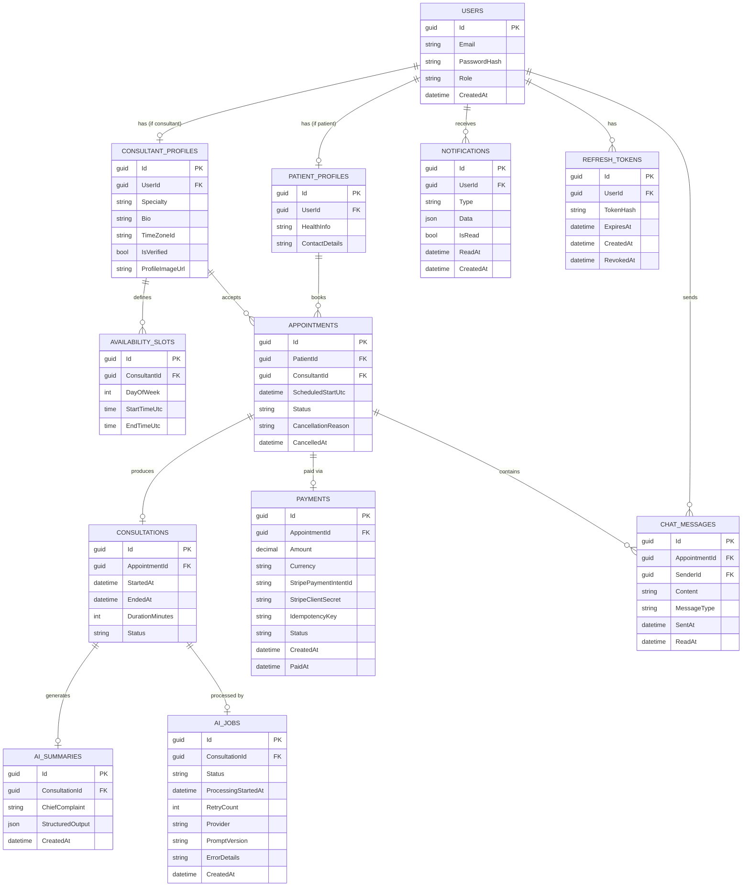

# Telehealth Platform — Entity Relationship Diagram

**Version:** v1 — Core entities + Supporting entities

```mermaid
erDiagram
    %% Core entities
    USERS ||--o| CONSULTANT_PROFILES : "has (if consultant)"
    USERS ||--o| PATIENT_PROFILES : "has (if patient)"
    CONSULTANT_PROFILES ||--o{ AVAILABILITY_SLOTS : defines
    CONSULTANT_PROFILES ||--o{ APPOINTMENTS : accepts
    PATIENT_PROFILES ||--o{ APPOINTMENTS : books
    APPOINTMENTS ||--o| CONSULTATIONS : produces

    %% Supporting entities
    APPOINTMENTS ||--o| PAYMENTS : "paid via"
    APPOINTMENTS ||--o{ CHAT_MESSAGES : contains
    USERS ||--o{ CHAT_MESSAGES : sends
    CONSULTATIONS ||--o| AI_SUMMARIES : generates
    CONSULTATIONS ||--o| AI_JOBS : "processed by"
    USERS ||--o{ NOTIFICATIONS : receives
    USERS ||--o{ REFRESH_TOKENS : has

    USERS {
        guid Id PK
        string Email
        string PasswordHash
        string Role
        datetime CreatedAt
    }

    CONSULTANT_PROFILES {
        guid Id PK
        guid UserId FK
        string Specialty
        string Bio
        string TimeZoneId
        bool IsVerified
        string ProfileImageUrl
    }

    PATIENT_PROFILES {
        guid Id PK
        guid UserId FK
        string HealthInfo
        string ContactDetails
    }

    AVAILABILITY_SLOTS {
        guid Id PK
        guid ConsultantId FK
        int DayOfWeek
        time StartTimeUtc
        time EndTimeUtc
    }

    APPOINTMENTS {
        guid Id PK
        guid PatientId FK
        guid ConsultantId FK
        datetime ScheduledStartUtc
        string Status
        string CancellationReason
        datetime CancelledAt
    }

    CONSULTATIONS {
        guid Id PK
        guid AppointmentId FK
        datetime StartedAt
        datetime EndedAt
        int DurationMinutes
        string Status
    }

    PAYMENTS {
        guid Id PK
        guid AppointmentId FK
        decimal Amount
        string Currency
        string StripePaymentIntentId
        string StripeClientSecret
        string IdempotencyKey
        string Status
        datetime CreatedAt
        datetime PaidAt
    }

    CHAT_MESSAGES {
        guid Id PK
        guid AppointmentId FK
        guid SenderId FK
        string Content
        string MessageType
        datetime SentAt
        datetime ReadAt
    }

    AI_SUMMARIES {
        guid Id PK
        guid ConsultationId FK
        string ChiefComplaint
        json StructuredOutput
        datetime CreatedAt
    }

    AI_JOBS {
        guid Id PK
        guid ConsultationId FK
        string Status
        datetime ProcessingStartedAt
        int RetryCount
        string Provider
        string PromptVersion
        string ErrorDetails
        datetime CreatedAt
    }

    NOTIFICATIONS {
        guid Id PK
        guid UserId FK
        string Type
        json Data
        bool IsRead
        datetime ReadAt
        datetime CreatedAt
    }

    REFRESH_TOKENS {
        guid Id PK
        guid UserId FK
        string TokenHash
        datetime ExpiresAt
        datetime CreatedAt
        datetime RevokedAt
    }
```
