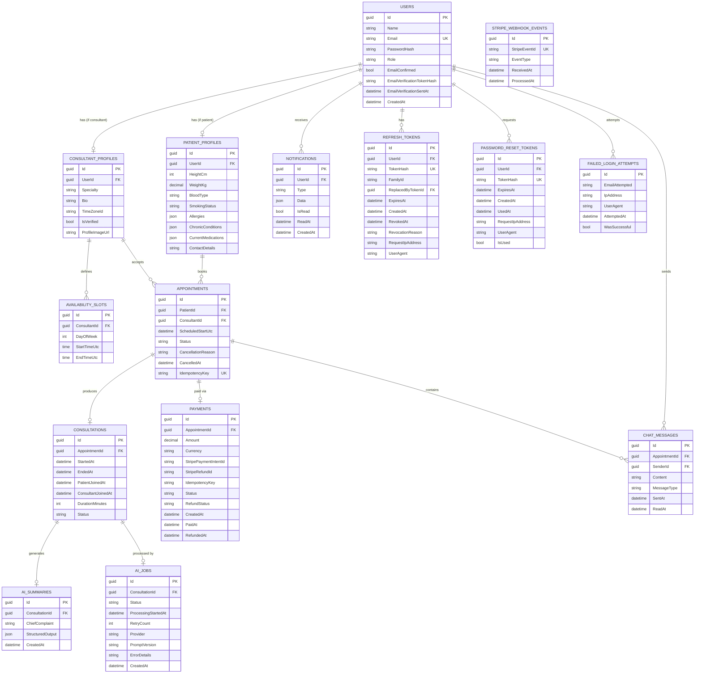

# Telehealth Platform — Entity Relationship Diagram

**Version:** v1.4 — Core entities + Supporting entities + Security entities + Refund Flow + HealthProfile Value Object + No-Show Detection

---

## Security Entities (added v1.1)

### `Users` — Modified
- `Email` → added `UK` (unique constraint was implied, now explicit)
- `EmailConfirmed` → new. `false` at registration; `true` after email verification. Gate for booking/payment.
- `EmailVerificationTokenHash` → new. SHA256 hash of the raw verification token sent via email. Cleared after verification.
- `EmailVerificationSentAt` → new. Tracks when the last verification email was sent (rate-limiting + expiry check).

### `RefreshTokens` — Modified
- `TokenHash` → added `UK` (unique constraint, was implied).
- `FamilyId` → new. Groups all tokens produced by rotation from the same initial login. Enables "nuclear option" on reuse detection.
- `ReplacedByTokenId` → new. Self-referencing FK. Audit trail: which token replaced this one during rotation.
- `RevocationReason` → new. Enum: `ReplacedByRotation`, `PasswordChanged`, `UserLogout`, `ReuseDetected`, `AdminAction`.
- `RequestIpAddress` / `UserAgent` → new. Minimal fingerprinting for v1 audit trail.

### `PasswordResetTokens` — New
Same security pattern as `RefreshTokens`: raw token never stored; only `SHA256(Token)` is persisted.
- `TokenHash` → `UK`. SHA256 of the 256-bit cryptographically random raw token.
- `ExpiresAt` → 1 hour absolute from `CreatedAt`.
- `IsUsed` → single-use enforcement. Once `true`, token is permanently invalid.
- `UsedAt` → audit trail.
- `RequestIpAddress` / `UserAgent` → audit trail.

### `FailedLoginAttempts` — New
Audit-only table (not used for lockout logic — that is handled by ASP.NET Core Identity).
- `EmailAttempted` → the email string submitted (may not exist in `Users`).
- `IpAddress` / `UserAgent` / `AttemptedAt` / `WasSuccessful` → forensic data for v2 alerting rules.

---

### `PatientProfiles` — HealthProfile Value Object (added v1.3)

Replaced the v1.2 `HealthInfo` string field with a structured Value Object. This is an **owned entity** (not a separate table) — stored as JSON columns or via EF Core `OwnsOne` / `ToJson()`.

**Fields:**
- `HeightCm` → nullable int, validated range 50–300 cm
- `WeightKg` → nullable decimal, validated range 2–500 kg
- `BloodType` → enum: `Unknown`, `APositive`, `ANegative`, `BPositive`, `BNegative`, `ABPositive`, `ABNegative`, `OPositive`, `ONegative`
- `SmokingStatus` → enum: `Unknown`, `Never`, `Former`, `Current`
- `Allergies` → JSON array of strings (e.g., `["Penicillin", "Peanuts"]`)
- `ChronicConditions` → JSON array of strings (e.g., `["Hypertension", "Type 2 Diabetes"]`)
- `CurrentMedications` → JSON array of strings (e.g., `["Metformin 500mg", "Lisinopril 10mg"]`)

**Why not a string?**
- Enables validation (range checks, enum constraints)
- Enables querying ("find all patients with diabetes")
- Enables structured AI context for consultation summaries
- Enables clean Flutter form UI (separate fields, not a text blob)

**All fields are nullable** — patients are not required to provide health data, but when they do it must be structured and valid.

### `Consultations` — No-Show Detection Fields (added v1.4)

Added two nullable timestamp fields to support automatic no-show detection:

- `PatientJoinedAt` → set when the patient successfully calls `JoinCall` (SignalR hub method). Null if patient never joined.
- `ConsultantJoinedAt` → set when the consultant successfully calls `JoinCall`. Null if consultant never joined.
- `StartedAt` → set when the *first* participant joins (call transitions to `InProgress`). Null if call never started.

**No-show evaluation (BackgroundService, 15 minutes after `ScheduledStartUtc`):**
- `StartedAt IS NULL` + `PatientJoinedAt IS NULL` + `ConsultantJoinedAt HAS VALUE` → **Patient no-show**
- `StartedAt IS NULL` + `PatientJoinedAt HAS VALUE` + `ConsultantJoinedAt IS NULL` → **Consultant no-show**
- `StartedAt IS NULL` + both null → **Mutual no-show**

These fields enable the refund policy (§3.2.1) to be applied automatically without manual intervention.
