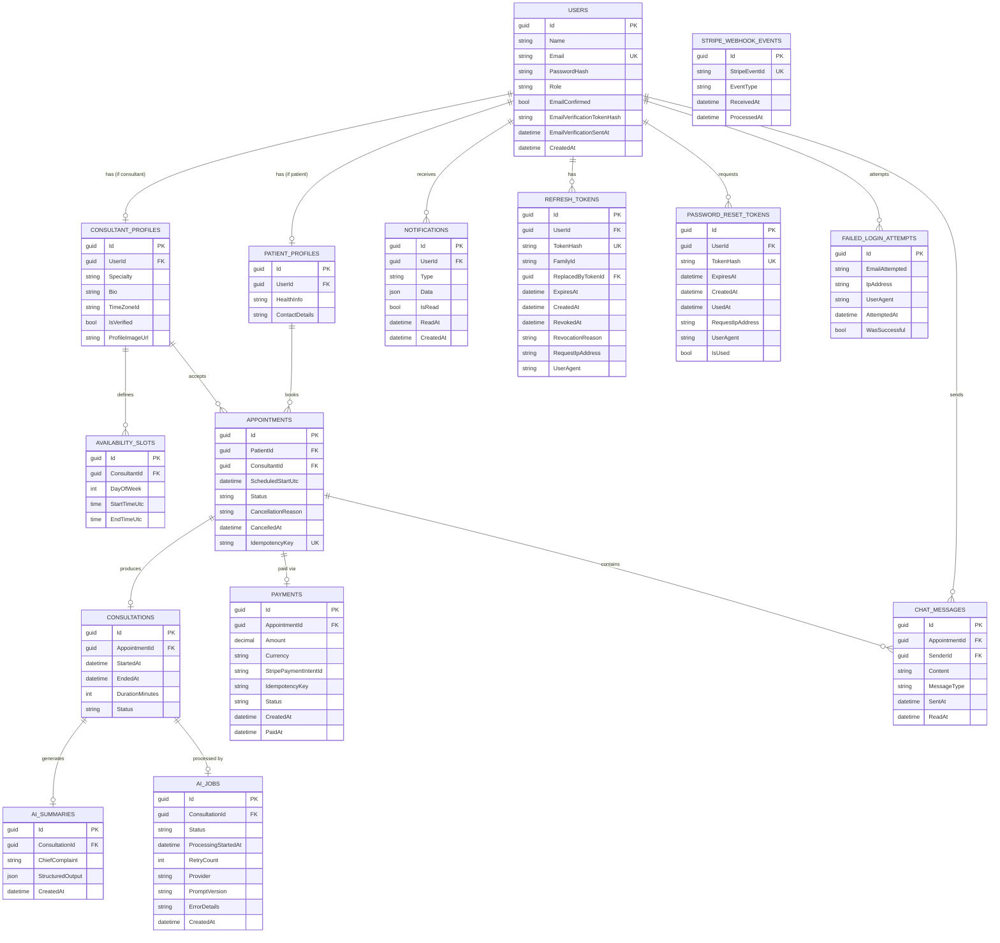

# Telehealth Platform — Entity Relationship Diagram

**Version:** v1.1 — Core entities + Supporting entities + Security entities

---

## Security Entities (added v1.1)

### `Users` — Modified
- `Email` → added `UK` (unique constraint was implied, now explicit)
- `EmailConfirmed` → new. `false` at registration; `true` after email verification. Gate for booking/payment.
- `EmailVerificationTokenHash` → new. SHA256 hash of the raw verification token sent via email. Cleared after verification.
- `EmailVerificationSentAt` → new. Tracks when the last verification email was sent (rate-limiting + expiry check).

### `RefreshTokens` — Modified
- `TokenHash` → added `UK` (unique constraint, was implied).
- `FamilyId` → new. Groups all tokens produced by rotation from the same initial login. Enables "nuclear option" on reuse detection.
- `ReplacedByTokenId` → new. Self-referencing FK. Audit trail: which token replaced this one during rotation.
- `RevocationReason` → new. Enum: `ReplacedByRotation`, `PasswordChanged`, `UserLogout`, `ReuseDetected`, `AdminAction`.
- `RequestIpAddress` / `UserAgent` → new. Minimal fingerprinting for v1 audit trail.

### `PasswordResetTokens` — New
Same security pattern as `RefreshTokens`: raw token never stored; only `SHA256(Token)` is persisted.
- `TokenHash` → `UK`. SHA256 of the 256-bit cryptographically random raw token.
- `ExpiresAt` → 1 hour absolute from `CreatedAt`.
- `IsUsed` → single-use enforcement. Once `true`, token is permanently invalid.
- `UsedAt` → audit trail.
- `RequestIpAddress` / `UserAgent` → audit trail.

### `FailedLoginAttempts` — New
Audit-only table (not used for lockout logic — that is handled by ASP.NET Core Identity).
- `EmailAttempted` → the email string submitted (may not exist in `Users`).
- `IpAddress` / `UserAgent` / `AttemptedAt` / `WasSuccessful` → forensic data for v2 alerting rules.
