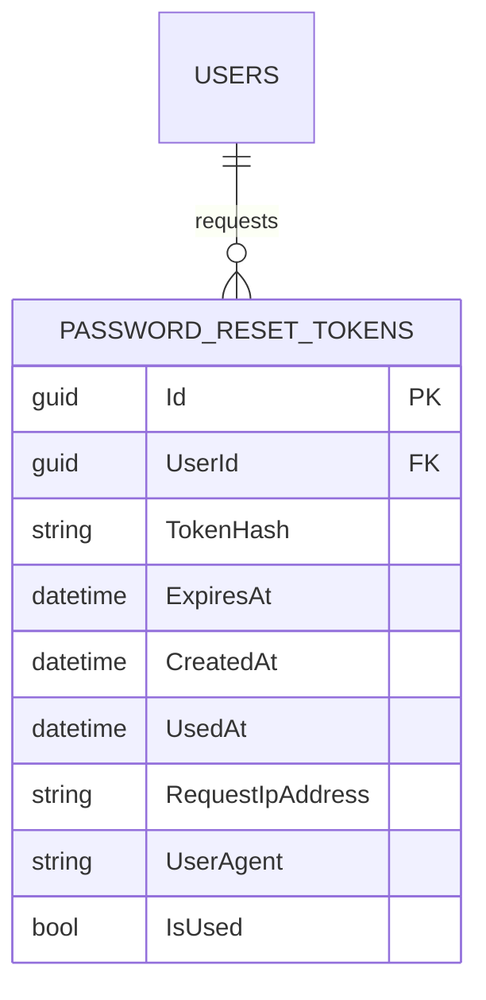
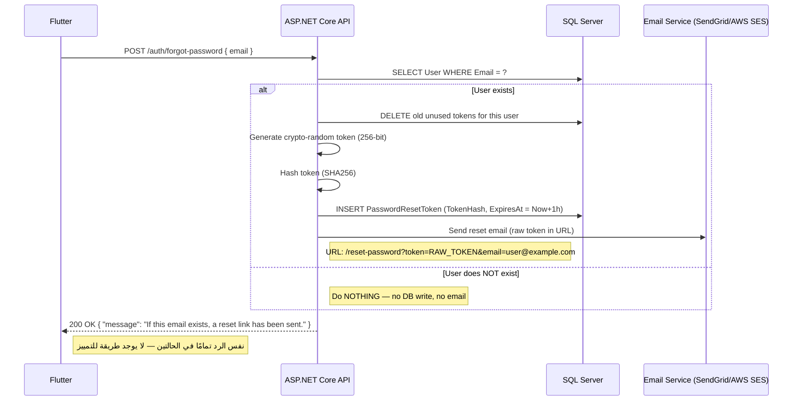
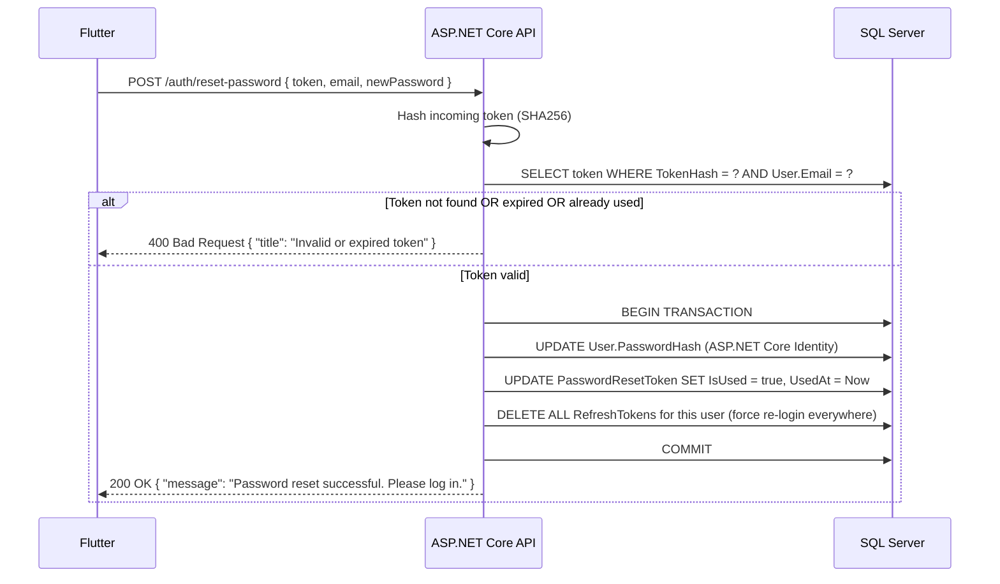
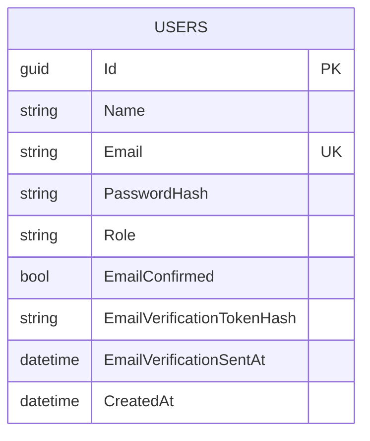
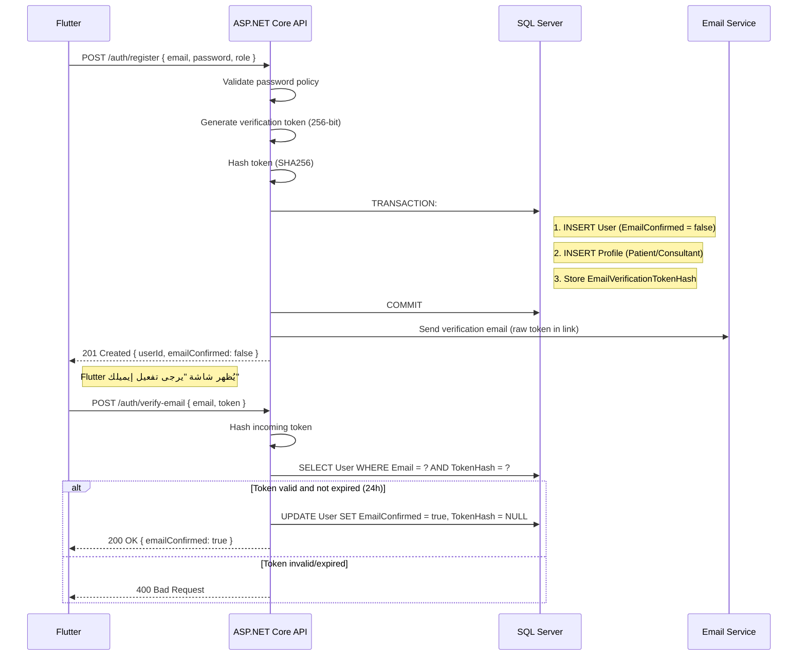
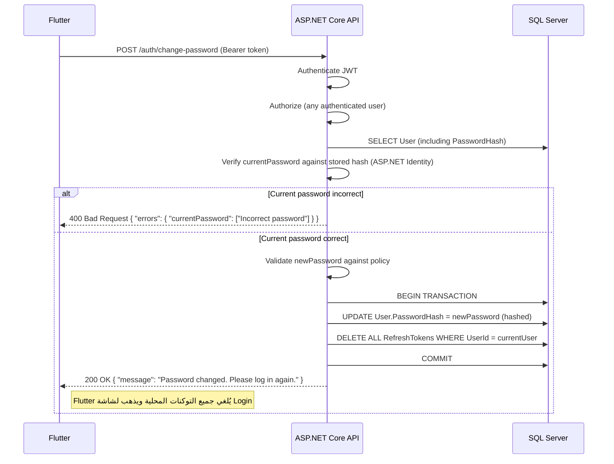
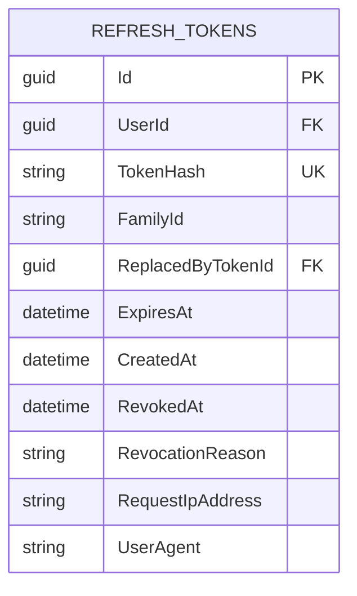
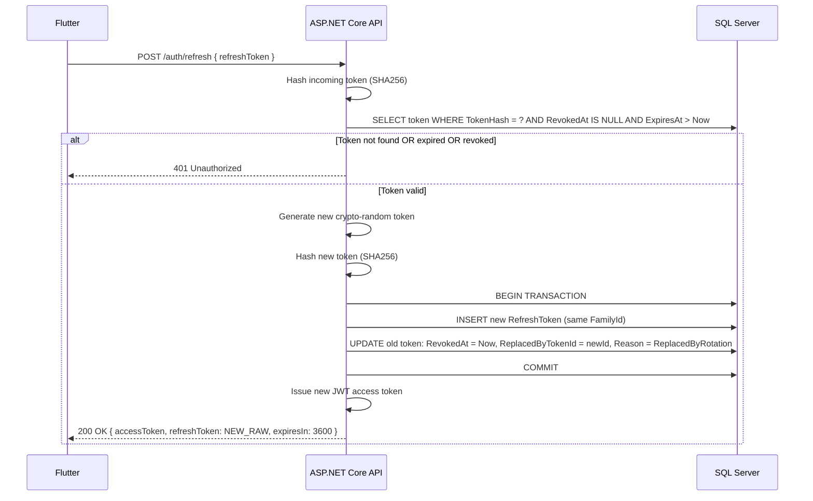
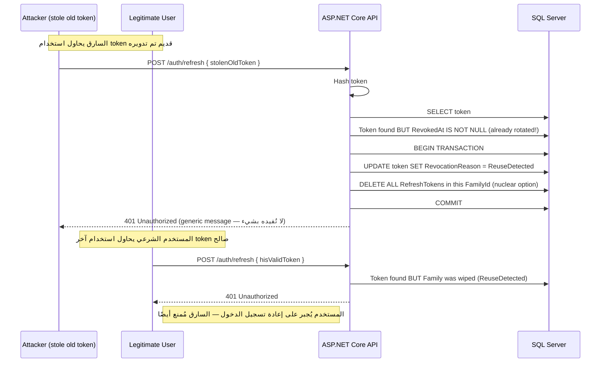
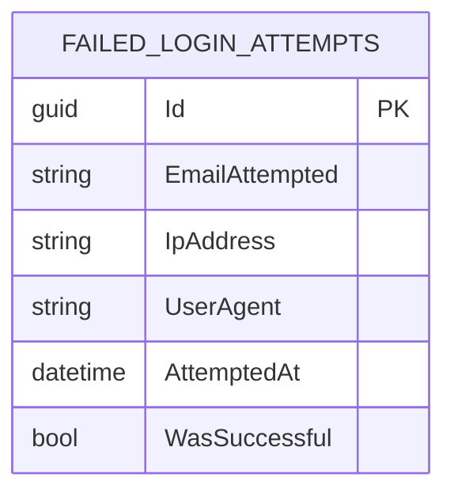

# AI Telehealth Platform — Security & Authentication Deep-Dive

**System Design Series · Document 5 of 5** (ERD → Architecture → Sequence Diagrams → API Contract → **Security Deep-Dive**)
**Stack:** ASP.NET Core 10 (Clean Architecture, CQRS/MediatR) + Flutter (Clean Architecture, BLoC)
**Status:** v1 — closes the authentication/security gaps identified post-API-Contract: Forgot/Reset Password, Email Verification, Change Password, Password Policy, Refresh Token Security, Account Lockout/Brute-force Protection

---

## 1. ما هي هذه الوثيقة؟

بعد الانتهاء من System Design الأساسي (ERD, Architecture, Sequence Diagrams, API Contract)، تبين أن هناك 6 مواضيع أمنية حرجة لم تُغطّى بالتفصيل الكافي لـ Production-Ready System. هذه الوثيقة تغلق هذه الثغرات — كل قرار هنا مبني على القرارات السابقة (مثلاً: نفس نمط `TokenHash` المستخدم في `RefreshTokens` يُعاد استخدامه في `PasswordResetTokens`).

المواضيع المغطاة:
1. **Forgot Password / Reset Password Flow** — مع حماية كاملة ضد enumeration attacks
2. **Email Verification** — إلزامي قبل السماح بأي إجراء حجز/دفع
3. **Change Password** — مع إبطال جميع الجلسات النشطة (security-first approach)
4. **Password Policy** — قواعد قوية + NIST guidelines
5. **Refresh Token Security** — تفاصيل التدوير (Rotation) + اكتشاف السرقة (Detection) + Family Binding
6. **Account Lockout / Brute-force Protection** — rate limiting على مستوى endpoint + account-level lockout

---

## 2. Forgot Password / Reset Password

### 2.1 الفلسفة: "Same Response, Different Paths"

أخطر خطأ في تصميم Forgot Password هو **User Enumeration**: إذا كان الرد يختلف بين "هذا الإيميل موجود" و"هذا الإيميل غير موجود"، فالمهاجم يستطيع بناء قائمة بجميع مستخدمي المنصة. القاعدة الذهبية:

> **بغض النظر عن وجود الإيميل في قاعدة البيانات، الرد للمستخدم يجب أن يكون متطابقًا تمامًا.**

### 2.2 ERD — الجدول الجديد



> **⚠️ لماذا `TokenHash` وليس `Token`؟** نفس المبدأ المستخدم في `RefreshTokens`: إذا تسربت قاعدة البيانات، لا يمكن للمهاجم استخدام الـ hash مباشرة. الـ raw token يبقى فقط في البريد الإلكتروني للمستخدم.

### 2.3 Sequence Diagram — Forgot Password



### 2.4 Sequence Diagram — Reset Password



### 2.5 API Contract

#### `POST /auth/forgot-password`
```json
// Request
{ "email": "user@example.com" }

// Response 200 (دائمًا — حتى لو الإيميل غير موجود)
{
  "message": "If this email is registered, you will receive a password reset link shortly."
}
```

**قواعد السلوك:**
- الرد يستغرق **نفس الوقت تقريبًا** في الحالتين (لمنع timing attacks). يمكن تحقيق ذلك بـ `Task.Delay(random 50-150ms)` في مسار "User not found".
- لا يتم إنشاء token إلا إذا كان المستخدم موجودًا وموثق الإيميل (`EmailConfirmed = true`). إذا لم يكن موثقًا، نعيد نفس الرد 200 ولكن لا نرسل بريد — هذا يمنع إرسال بريد عشوائي (email bombing) لإيميلات غير مسجلة.
- Token صلاحيته **1 ساعة** فقط.
- Token يُستخدم **مرة واحدة فقط** (`IsUsed` flag).

#### `POST /auth/reset-password`
```json
// Request
{
  "email": "user@example.com",
  "token": "raw-token-from-email",
  "newPassword": "NewSecurePass123!"
}

// Response 200
{ "message": "Password updated successfully." }

// Response 400
{
  "type": ".../errors/invalid-token",
  "title": "Invalid or Expired Token",
  "status": 400,
  "detail": "The reset token is invalid, expired, or already used."
}
```

### 2.6 قرارات مقفلة

| القرار | التوضيح |
|---|---|
| **Token length** | 256-bit cryptographically random (32 bytes hex = 64 chars) |
| **Token storage** | SHA256 hash only — raw token never persisted |
| **Token expiry** | 1 hour absolute |
| **Single-use** | `IsUsed` flag — used token = invalid forever |
| **Post-reset action** | جميع `RefreshTokens` للمستخدم تُحذف — يُجبر على إعادة تسجيل الدخول على جميع الأجهزة |
| **Rate limit** | 3 طلبات/ساعة/IP على `/auth/forgot-password` |

---

## 3. Email Verification

### 3.1 الفلسفة: "Verify Before Trust"

في v1، لا يمكن للمستخدم حجز موعد أو إكمال أي إجراء مالي حتى يُوثق إيميله. هذا ليس "nice to have" — بل حماية ضد:
- تسجيلات وهمية (fake accounts)
- إرسال إشعارات عشوائية (email bombing)
- عدم القدرة على استعادة كلمة المرور (لأن Forgot Password يرفض إرسال بريد لإيميل غير موثق)

### 3.2 ERD — تعديل على `Users`



> **⚠️ لماذا لا نستخدم جدول منفصل للـ verification tokens؟** لأنها token مؤقتة جدًا (24 ساعة) ولا تحتاج history — كل تسجيل جديد يُلغي القديم. لكن إذا أردنا audit trail في v2، ننقلها لجدول `EmailVerificationTokens` منفصل.

### 3.3 Sequence Diagram — Registration مع Email Verification



### 3.4 API Contract

#### `POST /auth/verify-email`
```json
// Request
{ "email": "user@example.com", "token": "raw-token-from-email" }

// Response 200
{ "emailConfirmed": true }

// Response 400
{
  "type": ".../errors/invalid-verification-token",
  "title": "Invalid or Expired Verification Token",
  "status": 400
}
```

#### `POST /auth/resend-verification`
```json
// Request
{ "email": "user@example.com" }

// Response 200 (نفس الرد دائمًا — anti-enumeration)
{ "message": "If this email is registered and unverified, a new link has been sent." }
```

**Rate limit:** 3 طلبات/ساعة على `/auth/resend-verification`.

### 3.5 Guard Clauses — أين يُمنع المستخدم غير الموثق؟

| العملية | النقطة التي يُمنع فيها |
|---|---|
| **حجز موعد** | `POST /appointments` — يُرجع `403 Forbidden` مع `detail: "Email verification required"` |
| **الدفع** | ممنوع ضمنيًا لأن الحجز ممنوع |
| **Forgot Password** | لا يُرسل بريد لإيميل غير موثق — لكن الرد 200 متطابق |
| **Chat/Video** | لا يُسمح بالانضمام لموعد لم يُدفع ثمنه (chain of guards) |

---

## 4. Change Password

### 4.1 الفلسفة: "Active Sessions Are a Liability"

عندما يغير المستخدم كلمة المرور، يجب أن نفترض أن السبب قد يكون اكتشاف اختراق. لذلك:
> **تغيير كلمة المرور = إبطال جميع الجلسات النشطة (جميع Refresh Tokens) + إجبار إعادة تسجيل الدخول.**

### 4.2 Sequence Diagram



### 4.3 API Contract

#### `POST /auth/change-password`
```json
// Request
{
  "currentPassword": "OldPass123!",
  "newPassword": "NewSecurePass456!"
}

// Response 200
{ "message": "Password changed successfully. Please log in again." }

// Response 400 (current password wrong)
{
  "type": ".../errors/validation-failed",
  "title": "Validation Failed",
  "status": 400,
  "errors": { "currentPassword": ["Current password is incorrect."] }
}

// Response 400 (new password fails policy)
{
  "type": ".../errors/validation-failed",
  "title": "Validation Failed",
  "status": 400,
  "errors": { "newPassword": ["Password must be at least 12 characters..."] }
}
```

**هام:** لا يوجد `refreshToken` في الـ request — نحن نستخدم الـ `accessToken` (JWT) للمصادقة. لكننا نحذف **جميع** refresh tokens للمستخدم (بما في ذلك الذي يُستخدم حاليًا) لأننا لا نعرف أي جهاز قد يكون مخترقًا.

---

## 5. Password Policy

### 5.1 القواعد (مبنية على NIST SP 800-63B)

| القاعدة | القيمة | التبرير |
|---|---|---|
| **Minimum length** | 12 characters | NIST 2024: length > complexity |
| **Maximum length** | 128 characters | منع DoS على hashing algorithm |
| **Character variety** | At least 3 of 4: uppercase, lowercase, digit, special | لا نتطلب الكل — يكفي 3 أنواع |
| **Common password check** | Reject top 10,000 known passwords (HaveIBeenPwned list) | prevents credential stuffing |
| **No personal info** | Reject passwords containing email prefix or name | custom rule |
| **History** | **v1: NOT enforced** | يتطلب جدول `PasswordHistory` — v2 |
| **Expiry** | **v1: NOT enforced** | NIST 2024: forced expiry is harmful |

### 5.2 Implementation

```csharp
// FluentValidation rule example
RuleFor(x => x.Password)
    .MinimumLength(12).WithMessage("Password must be at least 12 characters.")
    .MaximumLength(128).WithMessage("Password cannot exceed 128 characters.")
    .Must(HaveAtLeastThreeCharacterTypes).WithMessage("Password must contain at least 3 of: uppercase, lowercase, number, special character.")
    .Must(NotBeCommonPassword).WithMessage("This password is too common. Please choose a stronger one.")
    .Must(NotContainPersonalInfo).WithMessage("Password cannot contain your name or email.");
```

**Common password list:** ملف JSON يحتوي top 10,000 passwords من [SecLists](https://github.com/danielmiessler/SecLists) — يُحمل في الذاكرة عند startup (حجمه ~100KB).

### 5.3 API Contract — Policy Endpoint

#### `GET /auth/password-policy`
```json
// Response 200 (public endpoint — no auth needed)
{
  "minLength": 12,
  "maxLength": 128,
  "requiredCharacterTypes": 3,
  "allowedSpecialCharacters": "!@#$%^&*()_+-=[]{}|;:,.<>?"
}
```

Flutter يستدعي هذا endpoint عند شاشة التسجيل/تغيير كلمة المرور ليُظهر المتطلبات للمستخدم قبل البدء.

---

## 6. Refresh Token Security — Deep Dive

### 6.1 الفلسفة: "Detect Theft, Don't Just Prevent It"

الـ Refresh Token هو أقوى credential في النظام — إذا سرق، يمكن استخدامه للحصول على access tokens جديدة إلى الأبد (حتى expiry). الحماية لا تقتصر على "تخزينه بأمان" بل تشمل:

1. **Token Rotation** — كل استخدام لـ refresh token يُنتج token جديد ويُلغي القديم
2. **Reuse Detection** — إذا استُخدم token مُلغى، هذا يعني سرقة
3. **Family Binding** — جميع tokens الناتجة من نفس تسجيل الدخول الأول تنتمي لـ "family" واحدة
4. **Binding** — ربط التوكن بـ fingerprint خفيف (IP + UserAgent hash — v1 minimal)

### 6.2 ERD — تعديل على `RefreshTokens`



**الحقول الجديدة:**
- `FamilyId`: GUID يُنشأ عند تسجيل الدخول الأول — جميع tokens الناتجة من rotation تشترك فيه
- `ReplacedByTokenId`: يشير للـ token الجديد الذي استبدل هذا — مفيد لـ audit trail
- `RevocationReason`: enum (`ReplacedByRotation`, `PasswordChanged`, `UserLogout`, `ReuseDetected`, `AdminAction`)

### 6.3 Sequence Diagram — Normal Rotation



### 6.4 Sequence Diagram — Reuse Detection (Theft Scenario)



### 6.5 API Contract — تعديلات

#### `POST /auth/refresh` (مُحدّث)
```json
// Request
{ "refreshToken": "raw-token" }

// Response 200 (normal)
{
  "accessToken": "eyJ...",
  "refreshToken": "new-raw-token...",
  "expiresIn": 3600
}

// Response 401 (any failure — generic, no enumeration)
{
  "type": ".../errors/authentication-failed",
  "title": "Authentication Failed",
  "status": 401,
  "detail": "Invalid or expired session. Please log in again."
}
```

**هام:** سواء كان الفشل بسبب expiry، أو revocation، أو reuse detection — الرد دائمًا 401 بنفس الشكل. لا نُعطي المهاجم أي معلومة.

### 6.6 قرارات مقفلة

| القرار | التوضيح |
|---|---|
| **Token lifetime** | Refresh token: 7 days. Access token (JWT): 15 minutes. |
| **Rotation** | إجباري — كل refresh يُنتج token جديد |
| **Reuse detection** | إذا استُخدم token مُلغى → حذف **جميع** tokens في نفس الـ family |
| **Storage** | SHA256 hash فقط — raw token في Flutter Secure Storage |
| **Expiry cleanup** | Hosted BackgroundService يحذف tokens منتهية الصلاحية (>30 يوم) |

---

## 7. Account Lockout / Brute-force Protection

### 7.1 الطبقات — Defense in Depth

لا نعتمد على آلية واحدة — بل 3 طبقات:

```
┌─────────────────────────────────────┐
│  Layer 1: Endpoint Rate Limiting    │  ← .NET Rate Limiter (global per IP)
│  (يحمي جميع endpoints)              │
├─────────────────────────────────────┤
│  Layer 2: Account Lockout           │  ← ASP.NET Core Identity
│  (يحمي حسابات المستخدمين)           │
├─────────────────────────────────────┤
│  Layer 3: Progressive Delays        │  ← Custom middleware
│  (يُبطئ المهاجم دون lockout كامل)  │
└─────────────────────────────────────┘
```

### 7.2 Layer 1: Endpoint Rate Limiting (.NET Built-in)

```csharp
// Program.cs — Fixed Window Limiter
builder.Services.AddRateLimiter(options =>
{
    options.AddFixedWindowLimiter("auth", opt =>
    {
        opt.PermitLimit = 10;
        opt.Window = TimeSpan.FromMinutes(1);
        opt.QueueProcessingOrder = QueueProcessingOrder.OldestFirst;
        opt.QueueLimit = 0; // no queue — hard reject
    });

    options.AddFixedWindowLimiter("ai", opt =>
    {
        opt.PermitLimit = 10;
        opt.Window = TimeSpan.FromMinutes(1);
    });

    options.OnRejected = async (context, token) =>
    {
        context.HttpContext.Response.StatusCode = 429;
        await context.HttpContext.Response.WriteAsJsonAsync(new
        {
            type = ".../errors/rate-limit-exceeded",
            title = "Too Many Requests",
            status = 429,
            detail = "Please slow down and try again later.",
            retryAfter = context.Lease.TryGetMetadata(MetadataName.RetryAfter, out var retryAfter) ? retryAfter.TotalSeconds : 60
        });
    };
});
```

**الـ policies:**

| Endpoint Group | Policy | Limit | Window |
|---|---|---|---|
| `/auth/*` (except register) | `auth` | 10 | 1 minute |
| `/auth/register` | `auth_strict` | 3 | 1 minute |
| `/auth/forgot-password` | `auth_strict` | 3 | 1 hour |
| `/ai/symptom-check` | `ai` | 10 | 1 minute |
| `/appointments` | `standard` | 30 | 1 minute |
| All other endpoints | `standard` | 60 | 1 minute |

### 7.3 Layer 2: Account Lockout (ASP.NET Core Identity)

```csharp
// Identity configuration
builder.Services.Configure<IdentityOptions>(options =>
{
    options.Lockout.DefaultLockoutTimeSpan = TimeSpan.FromMinutes(15);
    options.Lockout.MaxFailedAccessAttempts = 5;
    options.Lockout.AllowedForNewUsers = true;
});
```

**السلوك:**
- 5 محاولات تسجيل دخول فاشلة متتالية → الحساب مُقفل لـ 15 دقيقة
- الرد يبقى **generic** — `401 Unauthorized` بنفس الشكل سواء كان الباسورد خطأ أم الحساب مقفل. لا نُفيد المهاجم بأن الحساب موجود.
- **هام:** يجب تفعيل `AllowedForNewUsers = true` — افتراضيًا ASP.NET Identity يُعطل الـ lockout للمستخدمين الجدد (!).

### 7.4 Layer 3: Progressive Delays (Custom Middleware)

```csharp
// Middleware يُضاف بعد Rate Limiter
// لكل IP: عدد المحاولات الفاشلة في آخر 5 دقائق
// إذا > 3 → Response delay = (attempts - 3) * 2 seconds (max 10s)
```

هذا يُبطئ brute-force attacks دون التأثير على المستخدم العادي. يُخزن في Redis في v2، لكن في v1 يُخزن في-memory (كافٍ لـ single instance).

### 7.5 ERD — جدول `FailedLoginAttempts` (للـ audit trail)



> **هذا الجدول للـ audit فقط — لا يُستخدم في منطق الـ lockout.** الـ lockout يعتمد على ASP.NET Identity built-in. لكن تسجيل المحاولات يساعد في:
> - اكتشاف هجمات موزعة (distributed brute-force)
> - تحليل أنماط الهجمات
> - v2: alerting rules (">100 failed attempts from different IPs in 1 hour")

### 7.6 API Contract — Rate Limit Response

#### `429 Too Many Requests`
```json
{
  "type": ".../errors/rate-limit-exceeded",
  "title": "Too Many Requests",
  "status": 429,
  "detail": "You have made too many requests. Please try again later.",
  "retryAfter": 45
}
```

**Headers:**
```
Retry-After: 45
X-RateLimit-Limit: 10
X-RateLimit-Remaining: 0
```

---

## 8. ملخص التعديلات على الوثائق السابقة

### 8.1 ERD — الجداول الجديدة/المُعدلة

| الجدول | التعديل |
|---|---|
| `Users` | إضافة: `EmailConfirmed`, `EmailVerificationTokenHash`, `EmailVerificationSentAt` |
| `RefreshTokens` | إضافة: `FamilyId`, `ReplacedByTokenId`, `RevocationReason`, `RequestIpAddress`, `UserAgent` |
| `PasswordResetTokens` | جديد — نسخة مُبسطة من `RefreshTokens` pattern |
| `FailedLoginAttempts` | جديد — audit trail فقط |

### 8.2 API Contract — Endpoints الجديدة

| Method | Route | Auth | Purpose |
|---|---|---|---|
| POST | `/auth/forgot-password` | — | Request password reset link |
| POST | `/auth/reset-password` | — | Reset password using token |
| POST | `/auth/verify-email` | — | Verify email address |
| POST | `/auth/resend-verification` | — | Resend verification email |
| POST | `/auth/change-password` | ✓ | Change password (invalidates all sessions) |
| GET | `/auth/password-policy` | — | Get password requirements |

### 8.3 Sequence Diagrams — الجديدة

1. **Forgot Password** — مع anti-enumeration
2. **Reset Password** — مع حذف جميع الجلسات
3. **Email Verification** — during registration
4. **Refresh Token Rotation** — normal flow
5. **Refresh Token Reuse Detection** — theft scenario

### 8.4 قرارات أمنية مقفلة

| # | القرار | المستند |
|---|---|---|
| 1 | **Anti-enumeration** — ردود `/auth/forgot-password` و `/auth/login` متطابقة تمامًا | §2.1, §7.3 |
| 2 | **Token hashing** — كل tokens (refresh, reset, verification) تُخزن كـ SHA256 hash فقط | §2.2, §6.2 |
| 3 | **Post-password-change session kill** — تغيير كلمة المرور يحذف جميع refresh tokens | §4.2 |
| 4 | **Reuse detection = nuclear option** — استخدام token مُلغى يُلغي **جميع** tokens في نفس الـ family | §6.4 |
| 5 | **Email verification gate** — لا حجز/دفع بدون `EmailConfirmed = true` | §3.5 |
| 6 | **Rate limiting layered** — 3 طبقات: endpoint limiter + account lockout + progressive delays | §7.1 |
| 7 | **Password policy NIST-based** — 12 chars min, no forced expiry, common password rejection | §5.1 |
| 8 | **Webhook-style atomicity** — نفس المبدأ المستخدم في Stripe webhook (§Sequence Diagrams) يُطبق هنا: أي عملية تتضمن multiple writes (مثل change password + delete tokens) تكون في transaction واحدة | §4.2, §6.3 |

---

## 9. Out of Scope (v1) — Security

- **2FA/MFA** — v2 (TOTP/SMS)
- **OAuth/Social Login** — v2 (Google, Apple Sign-In)
- **Device fingerprinting advanced** — v2 (geolocation, hardware ID)
- **Password history** — v2 (يتطلب جدول `PasswordHistory`)
- **IP allowlisting** — v2
- **Session management UI** — v2 ("Log out all other devices")
- **Security audit log** — v2 (جدول `SecurityEvents` مفصل)
- **CAPTCHA** — v2 (reCAPTCHA v3 على `/auth/register` و `/auth/forgot-password`)

---

**هذا يُغلق كافة الثغرات الأمنية المُحددة.** جميع الوثائق الخمسة الآن متسقة ومتكاملة وجاهزة للـ Implementation.
