# AI Telehealth Platform — Sequence Diagrams

**System Design Series · Document 3 of 4** (ERD → Architecture → **Sequence Diagrams** → API Contract)
**Stack:** ASP.NET Core 10 (Clean Architecture, CQRS/MediatR) + Flutter (Clean Architecture, BLoC)
**Status:** v8 — aligned with Requirements Document v19. Added No-Show Detection sequence diagram (background job, fault attribution, late-join protection).. Added Cancellation + Refund Flow sequence diagram.. Added Native SDK Layer sequence diagram (Platform Channel communication for WebRTC + Secure Storage). and Security Deep-Dive Document 5. Added Auth/Security sequence diagrams (Forgot/Reset Password, Email Verification, Refresh Token Rotation & Reuse Detection).

---

## Why only three diagrams

A Sequence Diagram isn't needed for every endpoint — only for flows with real decisions, branching, or timing complexity. The flows below are the ones with actual complexity worth working out **before** writing code:

1. **Booking → Payment → Confirmation** — transaction boundaries, concurrency, idempotency
2. **WebRTC Call Establishment** — signaling vs. media, STUN/TURN fallback
3. **Consultation → AI Summary** — async processing, retry, failure handling
4. **Forgot / Reset Password** — anti-enumeration, token security, session invalidation
5. **Email Verification** — registration flow, verification gate
6. **Refresh Token Rotation & Reuse Detection** — rotation, family binding, theft detection
7. **Flutter → Native SDK Communication** — Platform Channel pattern for WebRTC media pipeline and hardware-backed encryption

---

## 1. Booking → Payment → Confirmation

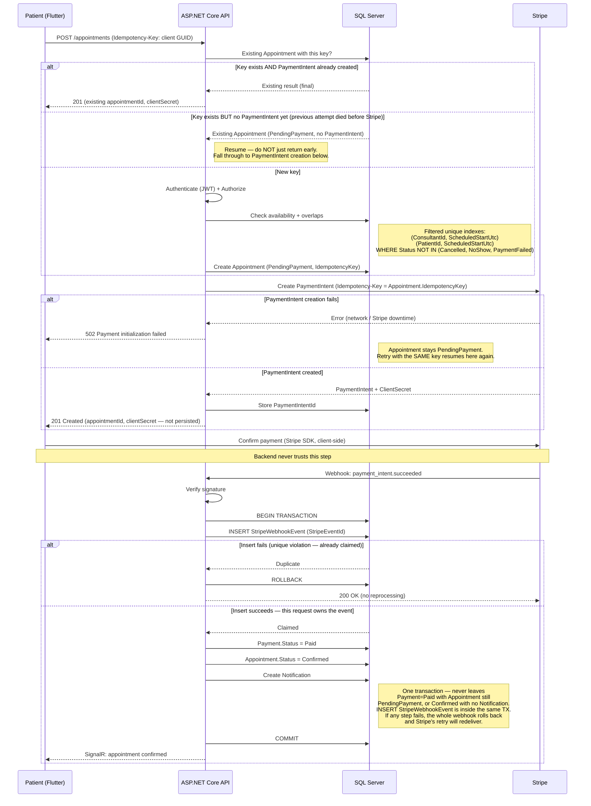

### What this flow locks in before implementation

- **"Key already exists" is not automatically "return it and stop" — this was a real bug in an earlier draft.** The retry behavior has to depend on how far the *previous* attempt actually got:
  - `PaymentIntent` already created → the original attempt succeeded past that point; return the existing result, nothing to redo.
  - `PendingPayment` with **no** `PaymentIntent` yet → the original attempt died *before* reaching Stripe. The correct behavior is to **resume** — fall through and attempt `PaymentIntent` creation now — not to return a half-finished result and strand the booking. This is exactly the scenario the Idempotency-Key was added to protect against; returning early here would have silently defeated its own purpose.
- **Webhook deduplication is atomic by construction, not by a check that races against itself.** A `SELECT ... WHERE StripeEventId = ?` followed by a separate insert has a race window: two near-simultaneous deliveries of the same event could both pass the check before either has recorded it. Instead, **the `INSERT` itself is the atomicity boundary** — attempt to insert the `StripeEventId` row first; if it fails on the `UNIQUE` constraint, another request already claimed this event and this one returns `200` without reprocessing; if it succeeds, this request has exclusively claimed the event.
- **The whole webhook effect is one transaction**, not four separate writes: `INSERT StripeWebhookEvent` + `Payment.Status = Paid` + `Appointment.Status = Confirmed` + `Create Notification`, committed together. This closes off partial-failure states that a sequence of independent writes could otherwise leave behind — e.g. `Payment = Paid` but `Appointment` still `PendingPayment`, or a `Confirmed` appointment with no `Notification` ever created. `SignalR` delivery happens only *after* the transaction commits.
- **Webhook order still matters: verify signature *first*, then touch `StripeEventId`.** The event ID is untrusted input until the signature proves the payload came from Stripe.
- **Two idempotency keys, two different failure points:** the booking-level `Idempotency-Key` (protects a lost response from `POST /appointments`) and the Stripe-level key (protects the `PaymentIntent` call) are the *same* value (`Payment.IdempotencyKey = Appointment.IdempotencyKey`), reused end-to-end rather than generated separately.
- **`StripeClientSecret` is never persisted** — returned to Flutter at creation time only, consistent with the Requirements Document decision (no v1 use case needs the backend to retrieve it later).
- **Retrieval on retry is required and must be documented in the API Contract.** Because `StripeClientSecret` is not stored, the retry path with an existing `PaymentIntentId` must retrieve the `PaymentIntent` from Stripe (`GET /v1/payment_intents/{id}`) to extract the `ClientSecret` before returning it to Flutter. This is a single, safe call — the PaymentIntent was created by this same backend.
- **Field naming is `ScheduledStartUtc` everywhere**, and the booking constraints are *filtered* unique indexes (`WHERE Status NOT IN (Cancelled, NoShow, PaymentFailed)`) so a cancelled appointment never permanently blocks a slot from being rebooked.

---

## 2. WebRTC Call Establishment

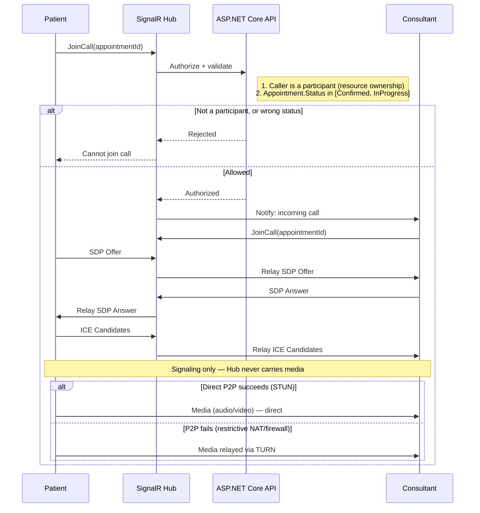

### What this flow locks in before implementation

- **Authorization is two checks, not one:** identity (is this caller a participant?) and state (is this appointment currently joinable?) — a real participant could still try to join a `Cancelled` or already-`Completed` appointment.
- **The Hub's job ends at signaling.** Once the peer connection is established, the Hub is no longer in the path — media never touches it.
- **STUN vs. TURN is a runtime fallback**, always attempting direct P2P first and relaying through TURN only when that fails.

---

## 3. Consultation → AI Summary

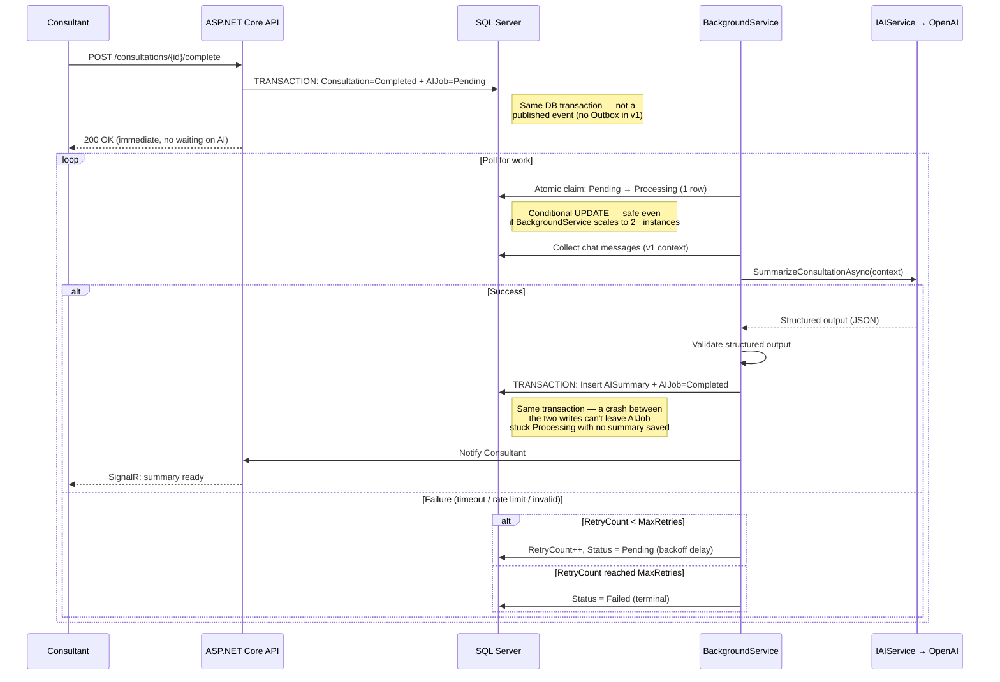

### What this flow locks in before implementation

- **`AIJob` is created transactionally**, in the same DB transaction as `CompleteConsultation` — not via a published event, which would only be safe with an Outbox Pattern (out of scope for v1).
- **Persisting the summary and completing the job are one transaction**, closing the window where a crash between the two writes could leave `AIJob` stuck `Processing` despite the summary already being saved.
- **Job claiming is atomic** — a single conditional update, not read-then-write — safe even if `BackgroundService` were ever scaled beyond one instance.
- **Context is explicitly v1-scoped:** chat messages only; voice transcription is a v2 addition.
- **Retry is bounded**, with a `MaxRetries` ceiling before moving to a terminal `Failed` status.
- **`AISummaries.ConsultationId` is unique**, enforcing the `0..1` cardinality at the database level.

---

## Cross-cutting pattern: persist first, notify second

All three flows share the same shape at the end: **write to the database (as one transaction where multiple writes are involved), then notify** — never the reverse.

```
Booking:      [Payment=Paid + Appointment=Confirmed + Notification] (1 TX) → SignalR
AI Summary:   [AISummary + AIJob=Completed] (1 TX) → SignalR
```

`SignalR` is a **delivery mechanism**, not a source of truth — if the recipient is offline, the notification simply stays unread in the `Notifications` table rather than being lost. And because the underlying state changes are wrapped in single transactions rather than sequences of independent writes, there's no partial-state window for a crash to expose in the first place.

---

**Next in the System Design series:** the full API Contract — endpoint list, request/response shapes, validation, authorization, and status codes, building directly on the flows above.


---

## 4. Forgot / Reset Password

### 4.1 Forgot Password — Anti-Enumeration Flow

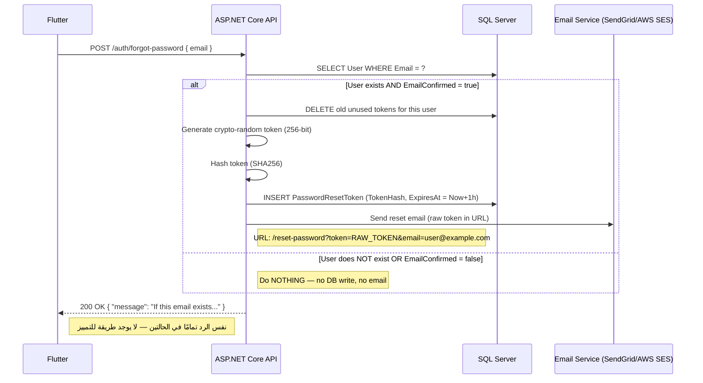

**Key decisions locked:**
- **Same response regardless of existence** — prevents user enumeration.
- **Timing normalization** — the "not found" path may include a small random delay (50–150ms) so both paths take approximately the same time, preventing timing attacks.
- **No email to unverified addresses** — prevents email bombing of arbitrary addresses.
- **Token hashing** — only `SHA256(Token)` is persisted; raw token exists only in the user's email inbox.

### 4.2 Reset Password — Session Kill

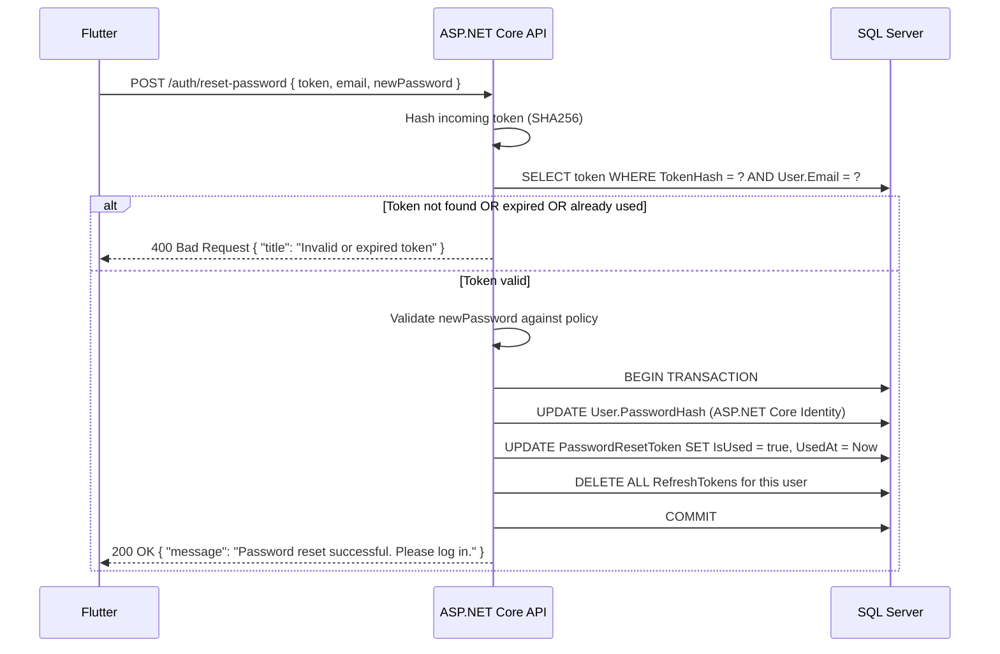

**Key decisions locked:**
- **Single-use token** — `IsUsed` flag makes the token permanently invalid after first use.
- **Post-reset nuclear option** — all `RefreshTokens` for the user are deleted, forcing re-login on all devices. This is a security-first decision: if the user forgot their password, we assume they may have been compromised.
- **Transaction boundary** — password update + token consumption + session invalidation happen in one transaction. A crash can't leave the password updated but sessions still valid.

---

## 5. Email Verification

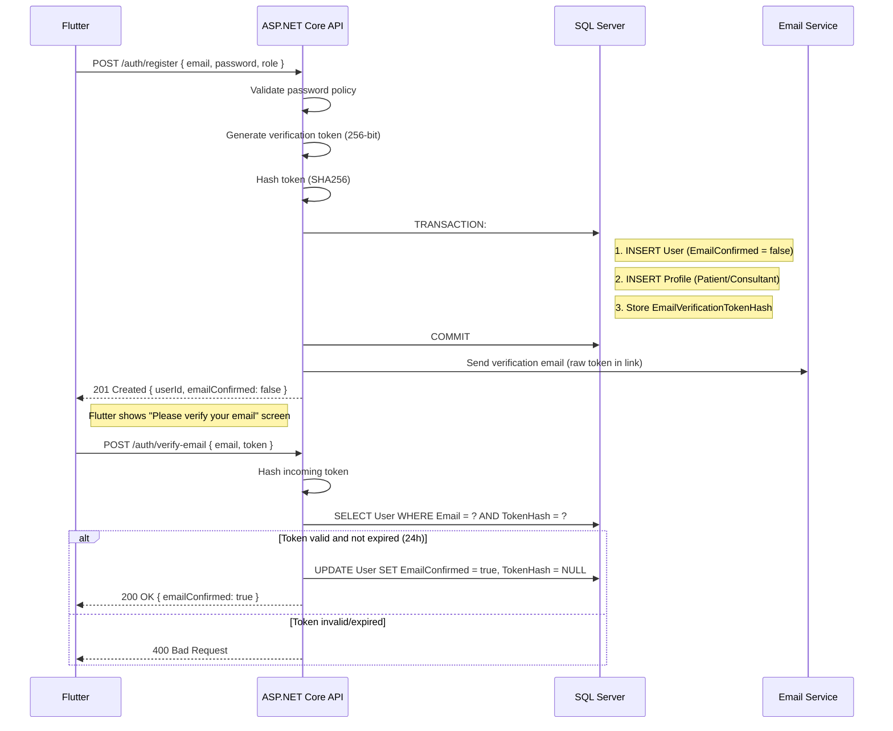

**Key decisions locked:**
- **Verification gate** — `EmailConfirmed = false` blocks booking (`POST /appointments` returns `403`) and payment (implicitly, via booking block).
- **Token storage** — `EmailVerificationTokenHash` on `Users` table (v1 minimal). v2 may split to a separate `EmailVerificationTokens` table for audit trail.
- **Auto-send on registration** — no separate "send verification" step required; the email goes out automatically as part of the registration transaction.

---

## 6. Refresh Token Rotation & Reuse Detection

### 6.1 Normal Rotation

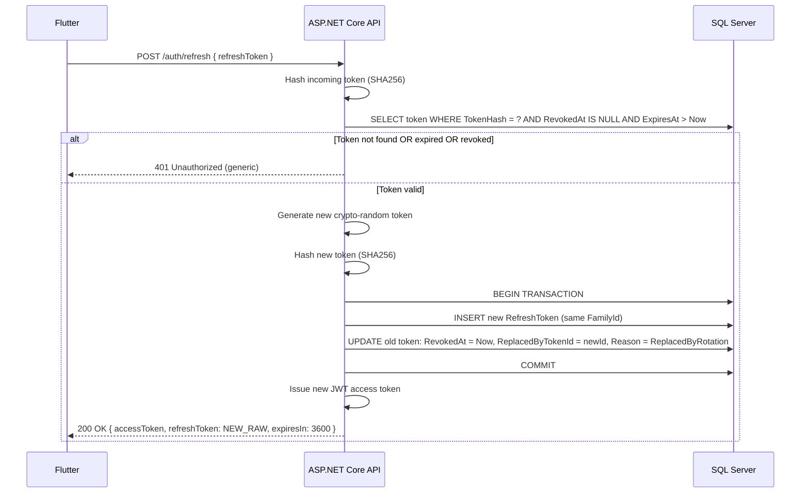

### 6.2 Reuse Detection — Theft Scenario

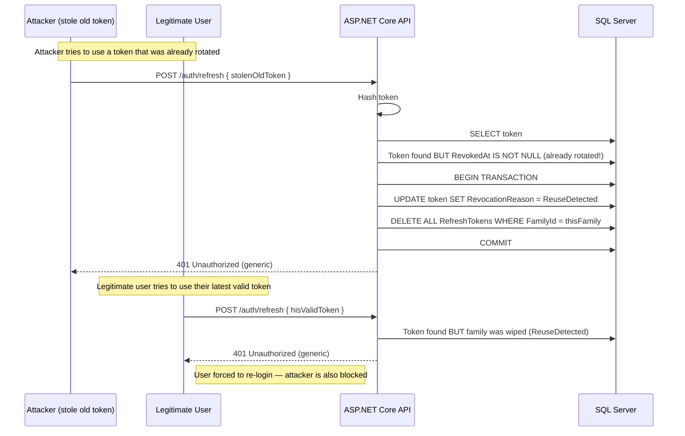

**Key decisions locked:**
- **Family binding** — all tokens from the same initial login share a `FamilyId`. This enables the "nuclear option": one detected reuse invalidates the entire family.
- **Generic 401** — regardless of failure reason (expired, revoked, reuse detected), the response is identical. No information leakage to attackers.
- **Token lifetime** — Refresh: 7 days. Access (JWT): 15 minutes.
- **Cleanup** — Hosted BackgroundService deletes expired tokens (>30 days old) to prevent table bloat.

---

## Cross-cutting pattern: persist first, notify second (extended)

All flows share the same shape at the end: **write to the database (as one transaction where multiple writes are involved), then notify** — never the reverse.

```
Booking:      [Payment=Paid + Appointment=Confirmed + Notification] (1 TX) → SignalR
AI Summary:   [AISummary + AIJob=Completed] (1 TX) → SignalR
Reset Password: [PasswordHash updated + Token marked used + RefreshTokens deleted] (1 TX) → HTTP 200
Change Password: [PasswordHash updated + RefreshTokens deleted] (1 TX) → HTTP 200
```

`SignalR` / HTTP response is a **delivery mechanism**, not a source of truth — if the recipient is offline or the request fails, the underlying state change is still safely committed.


---

## 7. Flutter → Native SDK Communication (Platform Channels)

This diagram shows how the Flutter app delegates platform-specific capabilities to native Kotlin (Android) and Swift (iOS) code while maintaining Clean Architecture boundaries.

### 7.1 WebRTC Media Initialization

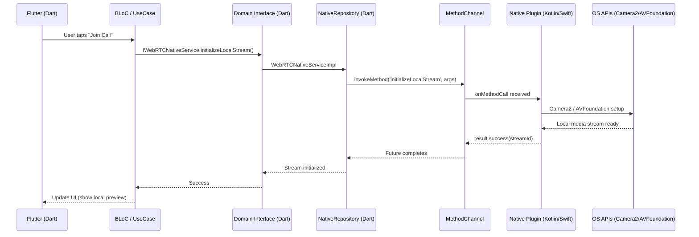

### 7.2 Secure Storage — Hardware-Backed Key Generation

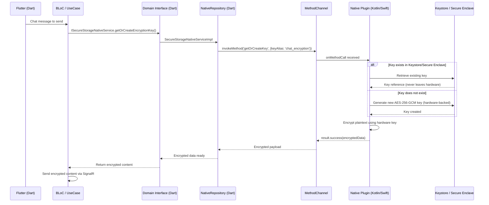

### 7.3 Incoming Call — CallKit (iOS) / ConnectionService (Android)

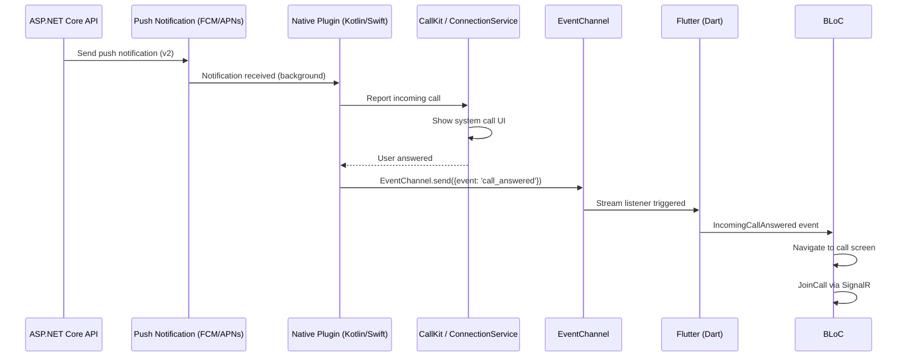

> **⚠️ Note:** Push notifications (FCM/APNs) are v2, but the native plugin structure for CallKit/ConnectionService must be designed in v1 so the architecture supports it. In v1, the incoming call is triggered by SignalR while the app is foreground, but the native service registration happens at app startup.

### What these diagrams lock in

- **Native code is a capability provider, not a decision maker.** All business logic (when to start a call, what to encrypt) stays in Dart Domain Layer.
- **MethodChannel for request/response** (synchronous-like calls: initialize camera, encrypt data).
- **EventChannel for streaming events** (asynchronous: incoming call events, ICE candidate events from native WebRTC).
- **Hardware-backed encryption keys never leave the secure hardware.** The native plugin encrypts/decrypts on the native side; only ciphertext crosses the Platform Channel boundary.
- **Clean Architecture preserved:** Domain Layer defines interfaces; Data Layer implements them using Platform Channels.


---

## 8. Cancellation + Refund Flow

This diagram covers both patient-initiated and consultant-initiated cancellations. The refund rule is identical for both: full automatic refund if cancelled more than 24 hours before the scheduled time; no refund if within 24 hours.

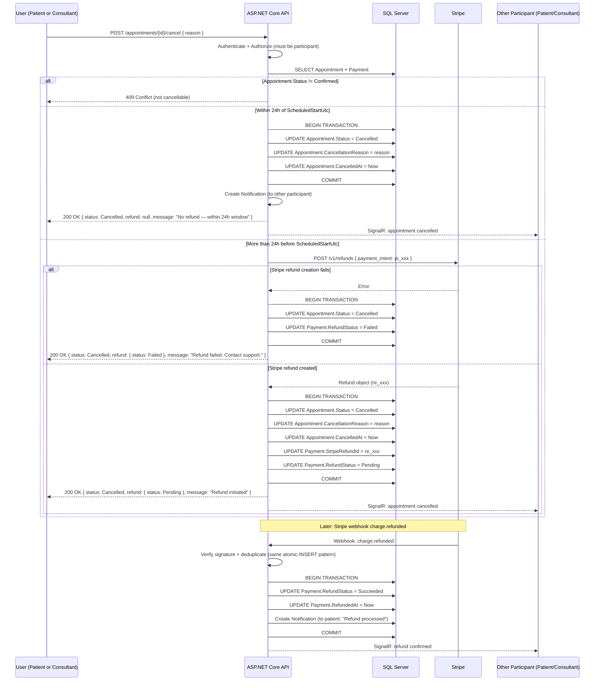

### What this flow locks in

- **Same refund rule for both parties** — patient or consultant, the 24h rule is identical. This keeps the policy simple and fair.
- **Refund is synchronous initiation, asynchronous confirmation** — the API calls Stripe immediately during cancellation, but the actual money movement is confirmed later via webhook (same atomic pattern as payment confirmation).
- **Transaction boundary** — `Appointment.Status = Cancelled` + `Payment.RefundStatus = Pending` + `StripeRefundId` are committed together. A crash can't leave the appointment cancelled with no refund record.
- **Failed refund handling** — if Stripe refund creation fails (rare), `RefundStatus = Failed` is recorded and the user is informed. Manual support intervention is needed (acceptable for v1).
- **Earnings impact** — `GET /consultants/me/earnings` excludes `RefundStatus = Succeeded` payments, so refunded appointments never count as income.
- **Notification to both parties** — whoever cancels, the other participant receives a SignalR notification + in-app notification.


---

## 9. No-Show Detection

This diagram shows how the system automatically detects and handles no-show appointments using a background job, without requiring manual intervention.

### 9.1 Normal Call Start (for contrast)

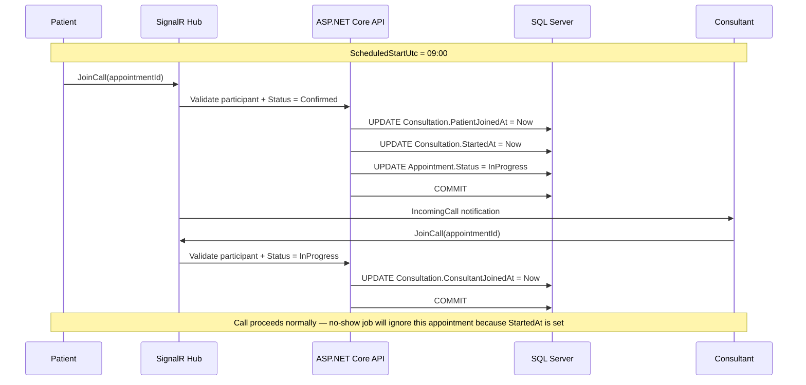

### 9.2 No-Show Detection — Background Job

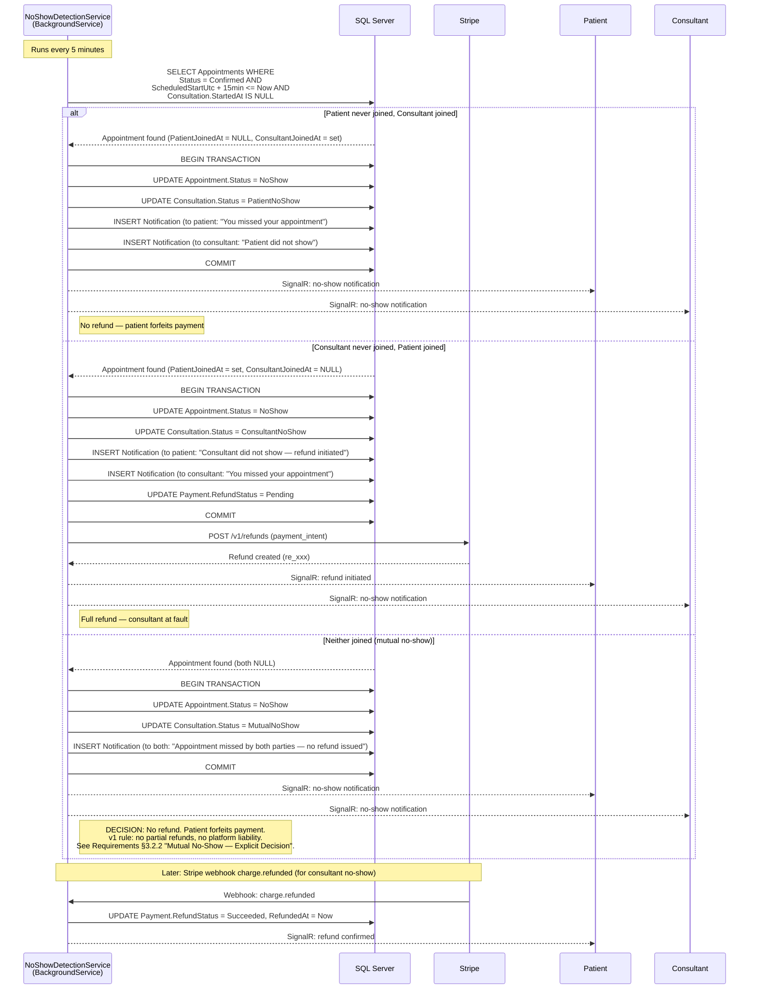

### 9.3 Late Join Attempt (after NoShow marked)

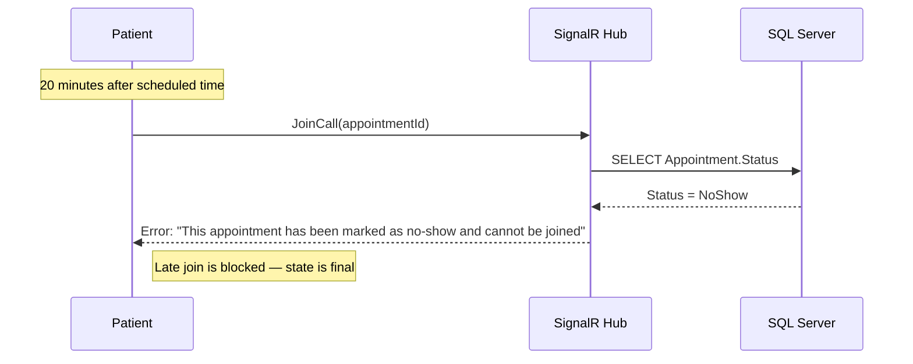

### What this flow locks in

- **15-minute grace period** — hard cutoff. Adjustable in v2 based on analytics.
- **Fault attribution** — who joined and who didn't determines who is at fault, which drives the refund decision (Requirements §3.2.1).
- **Single transaction** — status update + notification + refund initiation (if applicable) are committed together. A crash can't leave the appointment as `NoShow` with no notification sent.
- **Late join protection** — once `NoShow` is set, `JoinCall` rejects permanently. The appointment state is final.
- **Background job is idempotent** — if the job runs twice on the same appointment (e.g., server restart), the second run finds `Status = NoShow` and skips it. No double-processing.
- **No manual intervention** — the entire flow is automatic from detection to refund (for consultant no-show).
- **Mutual no-show is deterministic** — never leaves the appointment in an ambiguous state. The background job commits `MutualNoShow` + no refund immediately. There is no "null return" or "pending decision" state.
