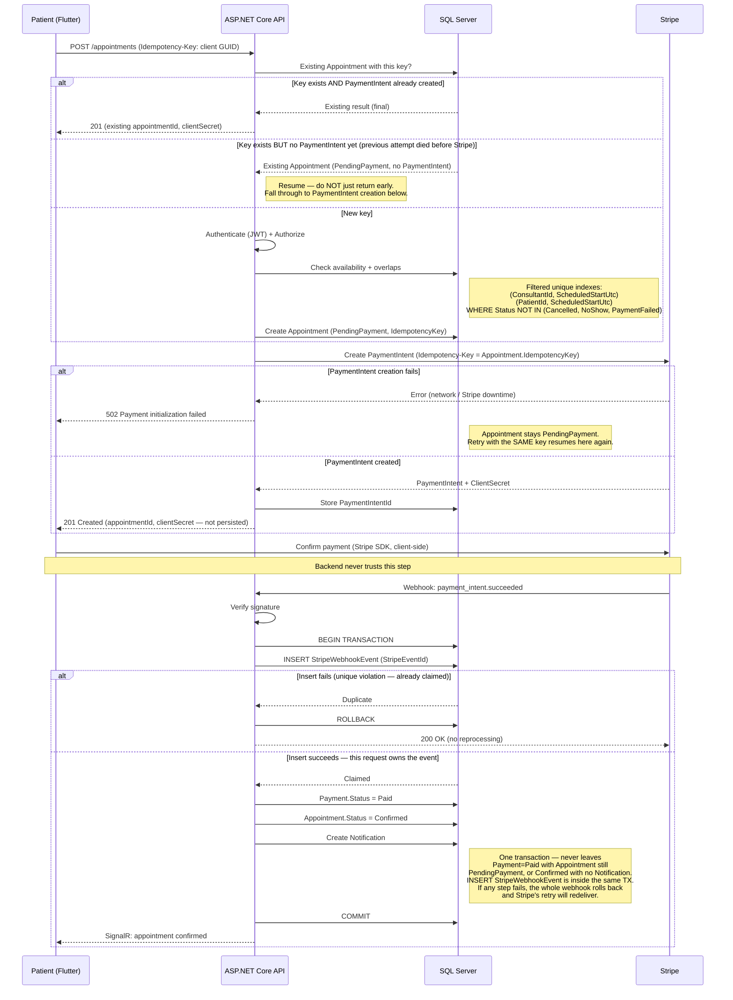
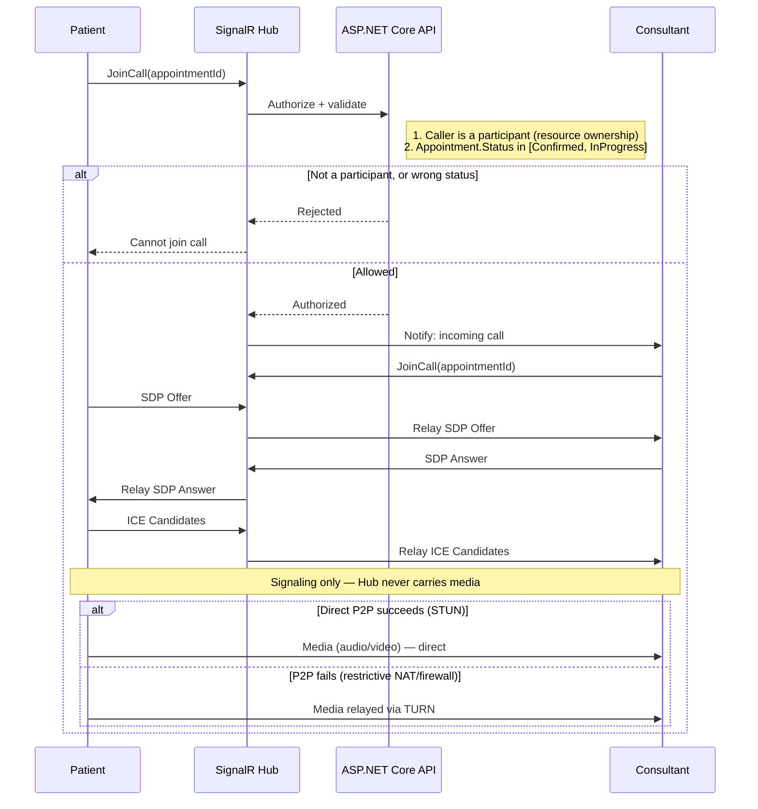
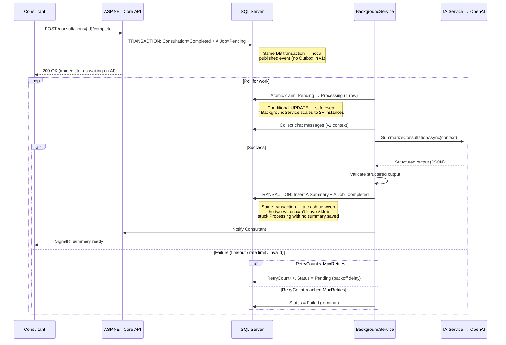

# AI Telehealth Platform — Sequence Diagrams

**System Design Series · Document 3 of 4** (ERD → Architecture → **Sequence Diagrams** → API Contract)
**Stack:** ASP.NET Core 10 (Clean Architecture, CQRS/MediatR) + Flutter (Clean Architecture, BLoC)
**Status:** v4 — aligned with Requirements Document v14 (fixed booking-retry logic bug, atomic/transactional webhook handling, StripeClientSecret resolved to not-persisted)

---

## Why only three diagrams

A Sequence Diagram isn't needed for every endpoint — only for flows with real decisions, branching, or timing complexity. The three flows below are the ones with actual complexity worth working out **before** writing code:

1. **Booking → Payment → Confirmation** — transaction boundaries, concurrency, idempotency
2. **WebRTC Call Establishment** — signaling vs. media, STUN/TURN fallback
3. **Consultation → AI Summary** — async processing, retry, failure handling

---

## 1. Booking → Payment → Confirmation



### What this flow locks in before implementation

- **"Key already exists" is not automatically "return it and stop" — this was a real bug in an earlier draft.** The retry behavior has to depend on how far the *previous* attempt actually got:
  - `PaymentIntent` already created → the original attempt succeeded past that point; return the existing result, nothing to redo.
  - `PendingPayment` with **no** `PaymentIntent` yet → the original attempt died *before* reaching Stripe. The correct behavior is to **resume** — fall through and attempt `PaymentIntent` creation now — not to return a half-finished result and strand the booking. This is exactly the scenario the Idempotency-Key was added to protect against; returning early here would have silently defeated its own purpose.
- **Webhook deduplication is atomic by construction, not by a check that races against itself.** A `SELECT ... WHERE StripeEventId = ?` followed by a separate insert has a race window: two near-simultaneous deliveries of the same event could both pass the check before either has recorded it. Instead, **the `INSERT` itself is the atomicity boundary** — attempt to insert the `StripeEventId` row first; if it fails on the `UNIQUE` constraint, another request already claimed this event and this one returns `200` without reprocessing; if it succeeds, this request has exclusively claimed the event.
- **The whole webhook effect is one transaction**, not four separate writes: `INSERT StripeWebhookEvent` + `Payment.Status = Paid` + `Appointment.Status = Confirmed` + `Create Notification`, committed together. This closes off partial-failure states that a sequence of independent writes could otherwise leave behind — e.g. `Payment = Paid` but `Appointment` still `PendingPayment`, or a `Confirmed` appointment with no `Notification` ever created. `SignalR` delivery happens only *after* the transaction commits.
- **Webhook order still matters: verify signature *first*, then touch `StripeEventId`.** The event ID is untrusted input until the signature proves the payload came from Stripe.
- **Two idempotency keys, two different failure points:** the booking-level `Idempotency-Key` (protects a lost response from `POST /appointments`) and the Stripe-level key (protects the `PaymentIntent` call) are the *same* value (`Payment.IdempotencyKey = Appointment.IdempotencyKey`), reused end-to-end rather than generated separately.
- **`StripeClientSecret` is never persisted** — returned to Flutter at creation time only, consistent with the Requirements Document decision (no v1 use case needs the backend to retrieve it later).
- **Retrieval on retry is required and must be documented in the API Contract.** Because `StripeClientSecret` is not stored, the retry path with an existing `PaymentIntentId` must retrieve the `PaymentIntent` from Stripe (`GET /v1/payment_intents/{id}`) to extract the `ClientSecret` before returning it to Flutter. This is a single, safe call — the PaymentIntent was created by this same backend.
- **Field naming is `ScheduledStartUtc` everywhere**, and the booking constraints are *filtered* unique indexes (`WHERE Status NOT IN (Cancelled, NoShow, PaymentFailed)`) so a cancelled appointment never permanently blocks a slot from being rebooked.

---

## 2. WebRTC Call Establishment



### What this flow locks in before implementation

- **Authorization is two checks, not one:** identity (is this caller a participant?) and state (is this appointment currently joinable?) — a real participant could still try to join a `Cancelled` or already-`Completed` appointment.
- **The Hub's job ends at signaling.** Once the peer connection is established, the Hub is no longer in the path — media never touches it.
- **STUN vs. TURN is a runtime fallback**, always attempting direct P2P first and relaying through TURN only when that fails.

---

## 3. Consultation → AI Summary



### What this flow locks in before implementation

- **`AIJob` is created transactionally**, in the same DB transaction as `CompleteConsultation` — not via a published event, which would only be safe with an Outbox Pattern (out of scope for v1).
- **Persisting the summary and completing the job are one transaction**, closing the window where a crash between the two writes could leave `AIJob` stuck `Processing` despite the summary already being saved.
- **Job claiming is atomic** — a single conditional update, not read-then-write — safe even if `BackgroundService` were ever scaled beyond one instance.
- **Context is explicitly v1-scoped:** chat messages only; voice transcription is a v2 addition.
- **Retry is bounded**, with a `MaxRetries` ceiling before moving to a terminal `Failed` status.
- **`AISummaries.ConsultationId` is unique**, enforcing the `0..1` cardinality at the database level.

---

## Cross-cutting pattern: persist first, notify second

All three flows share the same shape at the end: **write to the database (as one transaction where multiple writes are involved), then notify** — never the reverse.

```
Booking:      [Payment=Paid + Appointment=Confirmed + Notification] (1 TX) → SignalR
AI Summary:   [AISummary + AIJob=Completed] (1 TX) → SignalR
```

`SignalR` is a **delivery mechanism**, not a source of truth — if the recipient is offline, the notification simply stays unread in the `Notifications` table rather than being lost. And because the underlying state changes are wrapped in single transactions rather than sequences of independent writes, there's no partial-state window for a crash to expose in the first place.

---

**Next in the System Design series:** the full API Contract — endpoint list, request/response shapes, validation, authorization, and status codes, building directly on the flows above.
